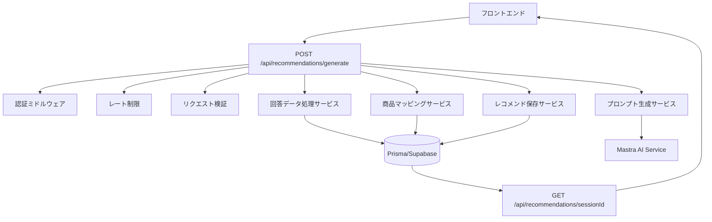

# 設計文書

## 概要

AI レコメンド生成機能は、完了したアンケートセッションの回答データを分析し、Mastra AI を活用してパーソナライズされた商品レコメンドを生成するシステムです。既存の Next.js + Prisma + Supabase アーキテクチャに統合され、POST /api/recommendations/generate エンドポイントとして実装されます。

## アーキテクチャ

### システム構成図



### レイヤー構成

1. **API レイヤー**: Next.js App Router (app/api/recommendations/generate/route.ts)
2. **ミドルウェアレイヤー**: 認証、レート制限、バリデーション
3. **サービスレイヤー**: ビジネスロジック処理
4. **データアクセスレイヤー**: Prisma ORM
5. **外部統合レイヤー**: Mastra AI 連携

## コンポーネントと インターフェース

### 1. データ処理サービス (lib/services/answer-processor.ts)

```typescript
interface ProcessedAnswer {
  questionId: string;
  questionText: string;
  questionType: QuestionType;
  answer: {
    optionLabel?: string;
    optionValue?: string;
    rangeValue?: number;
    textValue?: string;
  };
}

interface AnswerProcessorService {
  processSessionAnswers(sessionId: string): Promise<ProcessedAnswer[]>;
  structureForAI(answers: ProcessedAnswer[]): Promise<AIInputData>;
}
```

### 2. プロンプト生成サービス (lib/services/prompt-generator.ts)

```typescript
interface PromptTemplate {
  categoryId: string;
  systemPrompt: string;
  userPromptTemplate: string;
  outputFormat: string;
}

interface PromptGeneratorService {
  generatePrompt(
    categoryId: string,
    userProfile: UserProfile,
    answers: ProcessedAnswer[]
  ): Promise<string>;
  getCategoryTemplate(categoryId: string): Promise<PromptTemplate>;
}
```

### 3. Mastra AI 連携サービス (lib/services/mastra-ai.ts)

```typescript
interface AIRecommendationRequest {
  prompt: string;
  maxRecommendations: number;
  temperature?: number;
}

interface AIRecommendationResponse {
  recommendations: {
    productName: string;
    reason: string;
    score: number;
    features: string[];
    priceRange?: {
      min: number;
      max: number;
    };
  }[];
}

interface MastraAIService {
  generateRecommendations(
    request: AIRecommendationRequest
  ): Promise<AIRecommendationResponse>;
  validateResponse(response: any): boolean;
}
```

### 4. 商品マッピングサービス (lib/services/product-mapper.ts)

```typescript
interface ProductMatch {
  productId: string;
  confidence: number;
  matchReasons: string[];
}

interface ProductMapperService {
  mapAIRecommendationToProduct(
    aiRecommendation: AIRecommendationResponse["recommendations"][0],
    categoryId: string
  ): Promise<ProductMatch | null>;
  findSimilarProducts(
    name: string,
    features: string[],
    categoryId: string,
    priceRange?: { min: number; max: number }
  ): Promise<ProductMatch[]>;
}
```

### 5. レコメンド保存サービス (lib/services/recommendation-saver.ts)

```typescript
interface RecommendationData {
  sessionId: string;
  productId: string;
  rank: number;
  score: number;
  reason: string;
}

interface RecommendationSaverService {
  saveRecommendations(recommendations: RecommendationData[]): Promise<void>;
  checkExistingRecommendations(sessionId: string): Promise<boolean>;
}
```

## データモデル

### 既存テーブルの活用

- **QuestionnaireSession**: セッション管理、status='COMPLETED'の検証
- **Answer**: 回答データ取得、Question/QuestionOption との JOIN
- **Category**: カテゴリ情報、プロンプトテンプレート選択
- **Product**: 商品マスター、マッピング対象
- **ProductCategory**: カテゴリ別商品絞り込み
- **Recommendation**: 生成結果保存、rank/score/reason 管理

### データフロー

1. **入力**: sessionId (CUID)
2. **検証**: QuestionnaireSession.status = 'COMPLETED'
3. **取得**: Answer + Question + QuestionOption (JOIN)
4. **構造化**: QuestionType 別データ変換
5. **生成**: Mastra AI 呼び出し
6. **マッピング**: Product 検索・マッチング
7. **保存**: Recommendation 挿入 (rank 順)

## エラーハンドリング

### エラー分類と対応

1. **バリデーションエラー**

   - 無効な sessionId → 400 Bad Request
   - セッション未完了 → 400 Bad Request
   - 重複生成 → 400 Bad Request

2. **外部サービスエラー**

   - Mastra AI 接続失敗 → 503 Service Unavailable
   - AI レスポンス不正 → 502 Bad Gateway
   - タイムアウト → 504 Gateway Timeout

3. **データベースエラー**

   - 接続失敗 → 500 Internal Server Error
   - トランザクション失敗 → ロールバック + 500

4. **商品マッピングエラー**
   - マッチング失敗 → フォールバック処理
   - 信頼度不足 → 代替商品提案

### エラーログ戦略

```typescript
interface ErrorLog {
  timestamp: Date;
  sessionId: string;
  userId: string;
  errorType: "VALIDATION" | "AI_SERVICE" | "DATABASE" | "MAPPING";
  errorCode: string;
  message: string;
  stackTrace?: string;
  context: Record<string, any>;
}
```

## テスト戦略

### 1. ユニットテスト

- **AnswerProcessorService**: 質問タイプ別データ変換
- **PromptGeneratorService**: カテゴリ別プロンプト生成
- **ProductMapperService**: 商品マッチングロジック
- **RecommendationSaverService**: データベース操作

### 2. 統合テスト

- **API エンドポイント**: 全体フロー検証
- **Mastra AI 連携**: モック/実際の AI 呼び出し
- **データベーストランザクション**: 整合性確認

### 3. E2E テスト

- **完全なレコメンド生成フロー**
- **既存 API (GET /recommendations/[sessionId]) との連携**
- **エラーシナリオ処理**

### テストデータ

```typescript
// テスト用セッションデータ
const testSession = {
  id: "test-session-id",
  status: "COMPLETED",
  categoryId: "smartphone-category",
  userProfileId: "test-user-profile",
};

// テスト用回答データ
const testAnswers = [
  {
    questionType: "SINGLE_CHOICE",
    questionText: "予算はどのくらいですか？",
    optionLabel: "5万円以下",
    optionValue: "50000",
  },
  {
    questionType: "RANGE",
    questionText: "画面サイズの重要度",
    rangeValue: 8,
  },
];
```

## セキュリティ考慮事項

### 1. 認証・認可

- **requireAuth**: Supabase JWT 検証
- **ユーザー所有権**: セッション所有者確認
- **レート制限**: IP 別制限 (10req/min)

### 2. データ保護

- **入力サニタイゼーション**: Zod バリデーション
- **SQL インジェクション対策**: Prisma ORM 使用
- **機密情報**: AI プロンプトでの PII 除去

### 3. 外部 API セキュリティ

- **Mastra AI**: API キー管理
- **タイムアウト**: 30 秒制限
- **レスポンス検証**: スキーマ検証

## パフォーマンス最適化

### 1. データベース最適化

- **インデックス活用**: 既存インデックス利用
- **JOIN 最適化**: 必要フィールドのみ選択
- **トランザクション**: バッチ挿入

### 2. AI 呼び出し最適化

- **プロンプト最適化**: トークン数削減
- **並列処理**: 商品マッピングの並列実行
- **キャッシュ**: 類似プロンプトの結果キャッシュ

### 3. メモリ使用量

- **ストリーミング**: 大量データの段階的処理
- **ガベージコレクション**: 不要オブジェクトの早期解放

## 監視とログ

### 1. メトリクス

- **レスポンス時間**: API 全体、AI 呼び出し、DB 操作
- **成功率**: 生成成功/失敗率
- **商品マッピング精度**: マッチング成功率

### 2. ログレベル

- **INFO**: 正常フロー、処理時間
- **WARN**: フォールバック処理、低信頼度マッチング
- **ERROR**: エラー詳細、スタックトレース

### 3. アラート

- **高エラー率**: 5 分間で 50%以上
- **レスポンス遅延**: 平均 30 秒以上
- **AI サービス障害**: 連続失敗

## 設定管理

### 環境変数

```bash
# Mastra AI設定
MASTRA_API_KEY=your-api-key
MASTRA_API_URL=https://api.mastra.ai
MASTRA_TIMEOUT=30000

# レコメンド設定
MAX_RECOMMENDATIONS=10
MAPPING_CONFIDENCE_THRESHOLD=0.7
AI_TEMPERATURE=0.3
```

### 設定ファイル (lib/config/ai-recommendations.ts)

```typescript
export const AI_RECOMMENDATION_CONFIG = {
  maxRecommendations: parseInt(process.env.MAX_RECOMMENDATIONS || "10"),
  mappingThreshold: parseFloat(
    process.env.MAPPING_CONFIDENCE_THRESHOLD || "0.7"
  ),
  aiTemperature: parseFloat(process.env.AI_TEMPERATURE || "0.3"),
  timeouts: {
    aiRequest: parseInt(process.env.MASTRA_TIMEOUT || "30000"),
    dbOperation: 10000,
  },
};
```
